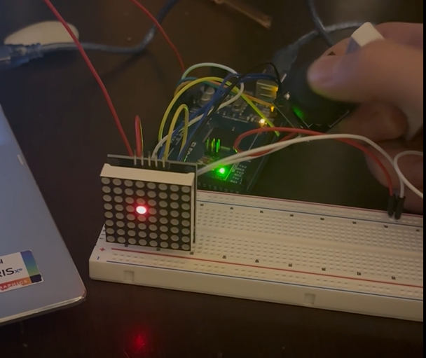

# LED Joystick Matrix Display

This project demonstrates how to control an 8x8 LED matrix using an Arduino and a joystick. The joystick's X and Y positions are read via analog pins, and the corresponding LED on the matrix lights up, allowing real-time interaction. The project uses SPI communication to drive the LED matrix and includes basic debugging via serial output.

---

## Features

- Real-time LED control based on joystick position  
- SPI communication with an 8x8 LED matrix  
- Simple, readable Arduino code  
- Serial output for debugging joystick coordinates  
- Includes demonstration photo and video

---

## Hardware Requirements

- Arduino Mega (or compatible)
- 8x8 LED Matrix with MAX7219 driver
- Joystick module (2-axis analog)
- Jumper wires

---

## Pin Connections

| Arduino Pin | Function            | Module Connection         |
|-------------|---------------------|--------------------------|
| 11          | DIN (SPI MOSI)      | MAX7219 DIN              |
| 12          | CS (SPI Chip Select)| MAX7219 CS               |
| 13          | CLK (SPI Clock)     | MAX7219 CLK              |
| 47          | LED1 (optional)     | Standalone LED           |
| 48          | LED2 (optional)     | Standalone LED           |
| 49          | LED3 (optional)     | Standalone LED           |
| A0          | Joystick X-axis     | Joystick VRX             |
| A1          | Joystick Y-axis     | Joystick VRY             |

---

## How It Works

- The Arduino reads the joystick's X and Y analog values.
- These values are mapped to the 8x8 grid coordinates.
- The LED at the mapped (X, Y) position lights up; all others are off.
- The code uses SPI to communicate with the MAX7219 driver for the LED matrix.
- Serial output prints joystick coordinates for debugging.

---

## Usage

1. Wire the hardware as described above.
2. Upload the provided code to your Arduino.
3. Open the Serial Monitor (115200 baud) to view joystick coordinates.
4. Move the joystick - the corresponding LED lights up on the matrix.
5. See the included photo and video for a demonstration.

---

## Media

- 

  

: Shows the hardware setup and matrix

---

## License

MIT License

---

## Credits

Project by Nathan Cannell.  
Photo and video included for demonstration purposes.

---

## Contact

For questions or suggestions, open an issue or contact me via GitHub.
